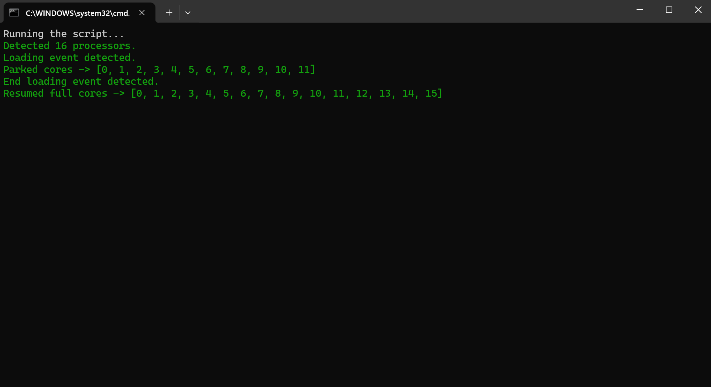

# 🛠️ # POE2 Freeze Fixer

**POE2 Freeze Fixer** is a script designed to resolve freezing issues in **Path of Exile 2** caused by the **Windows 24H2 update** and **AMD X3D CPUs**. The issue occurs during loading screens, and this script solves it by dynamically adjusting CPU core usage to **90% of available cores**, ensuring stability and preventing system lock-ups.

---

## ✨ Features

- 🔍 **Automatic Detection**: Detects the running Path of Exile 2 process.
- ⚙️ **Dynamic Core Management**: disables (parks) CPU cores during gameplay and loading to prevent crashes.
- 📄 **Log Monitoring**: Reads the `client.txt` file to track game loading events.
- 🪶 **Lightweight**: Runs quietly in the background with minimal resource usage.
- 📊 **Real-Time Feedback**: Displays **colored logs** for easy monitoring.

---

## 💻 Requirements

- 🖥️ **Windows** (Administrator permissions required).
- 🐍 **Python 3.x or newer** (automatically installed via `install.bat`).

---

## 🚀 Installation

1. **Download the Tool**:
   - Click the **Code** button on this page and select **Download ZIP**.
   - Extract the ZIP file to a folder on your computer.

2. **Install the Tool**:
   - Open the folder where you extracted the files.
   - Right-click on `install.bat` and select **Run as Administrator**.
   - This will:
     - Install Python (if needed).
     - Set up all required dependencies.

---

## 🕹️ How to Use

1. **Run the Tool**:
   - After installation, right-click on `run.bat` and select **Run as Administrator**.
   - The tool will:
     - Detect the running game process.
     - Monitor `client.txt` for loading events.
     - Dynamically adjust CPU usage during loading screens.

---

## 📋 Example Logs

  

---

## 🛠️ Troubleshooting

1. **Run as Administrator**:
   - The tool requires Administrator permissions to adjust CPU core usage.

2. **Log File Not Found**:
   - Make sure the game has a `logs/client.txt` file in its installation folder.
   - Restart the game if the file doesn’t exist.

3. **Python Not Installed**:
   - Run `install.bat` again to ensure Python and dependencies are correctly installed.

---
